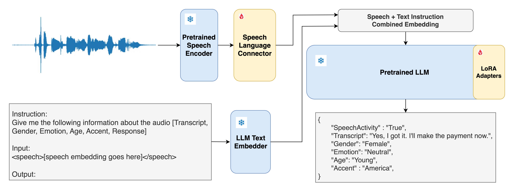

# SpeechLLM


SpeechLLM is a multi-modal LLM trained to predict the metadata of the speaker's turn in a conversation. speechllm-2B model is based on HubertX audio encoder and TinyLlama LLM. The model predicts the following:
1. **SpeechActivity** : if the audio signal contains speech (True/False)
2. **Transcript** : ASR transcript of the audio
3. **Gender** of the speaker (Female/Male)
4. **Age** of the speaker (Young/Middle-Age/Senior)
5. **Accent** of the speaker (Africa/America/Celtic/Europe/Oceania/South-Asia/South-East-Asia)
6. **Emotion** of the speaker (Happy/Sad/Anger/Neutral/Frustrated)

## Usage
```python
# Load model directly from huggingface
from transformers import AutoModel
model = AutoModel.from_pretrained("skit-ai/speechllm-2B", trust_remote_code=True)

model.generate_meta(
	audio_path="path-to-audio.wav", #16k Hz, mono
	instruction="Give me the following information about the audio [SpeechActivity, Transcript, Gender, Emotion, Age, Accent]",
	max_new_tokens=500, 
	return_special_tokens=False
)

# Model Generation
'''
{
  "SpeechActivity" : "True",
  "Transcript": "Yes, I got it. I'll make the payment now.",
  "Gender": "Female",
  "Emotion": "Neutral",
  "Age": "Young",
  "Accent" : "America",
}
'''
```

Try the model in [Google Colab Notebook](https://colab.research.google.com/drive/1uqhRl36LJKA4IxnrhplLMv0wQ_f3OuBM?usp=sharing).

## Model Weights
We released the speechllm-2B and speechllm-1.5B model checkpoints on huggingface :hugs:.
| **Model**         | **Speech Encoder**                                                                  | **LLM**                                                                                            | url                                                           |   |
|-------------------|-------------------------------------------------------------------------------------|----------------------------------------------------------------------------------------------------|---------------------------------------------------------------|---|
| **speechllm-2B**  | [facebook/hubert-xlarge-ll60k](https://huggingface.co/facebook/hubert-xlarge-ll60k) | [TinyLlama/TinyLlama-1.1B-Chat-v1.0](https://huggingface.co/TinyLlama/TinyLlama-1.1B-Chat-v1.0)    | [Huggingface](https://huggingface.co/skit-ai/speechllm-2B)    |   |
| **speechllm1.5B** | [microsoft/wavlm-large](https://huggingface.co/microsoft/wavlm-large)               | [ TinyLlama/TinyLlama-1.1B-Chat-v1.0 ]( https://huggingface.co/TinyLlama/TinyLlama-1.1B-Chat-v1.0) | [Huggingface]( https://huggingface.co/skit-ai/speechllm-1.5B) |   |


## Checkpoint Result

|         **Dataset**        |       **Type**      | **Word Error Rate** | **Gender Acc** | **Age Acc** | **Accent Acc** |
|:--------------------------:|:-------------------:|:-------------------:|:--------------:|:-----------:|:--------------:|
| **librispeech-test-clean** | Read Speech         |         6.73        |     0.9536     |             |                |
| **librispeech-test-other** | Read Speech         |         9.13        |     0.9099     |             |                |
| **CommonVoice test**       | Diverse Accent, Age |        24.27        |     0.8680     |    0.6251   |     0.6457     |
| **ML Spoken Words test**   | Short Utterance     |        36.12        |     0.6587     |             |                |
| **IEMOCAP test**           | Emotional Speech    |        44.15        |     0.7557     |             |                |
