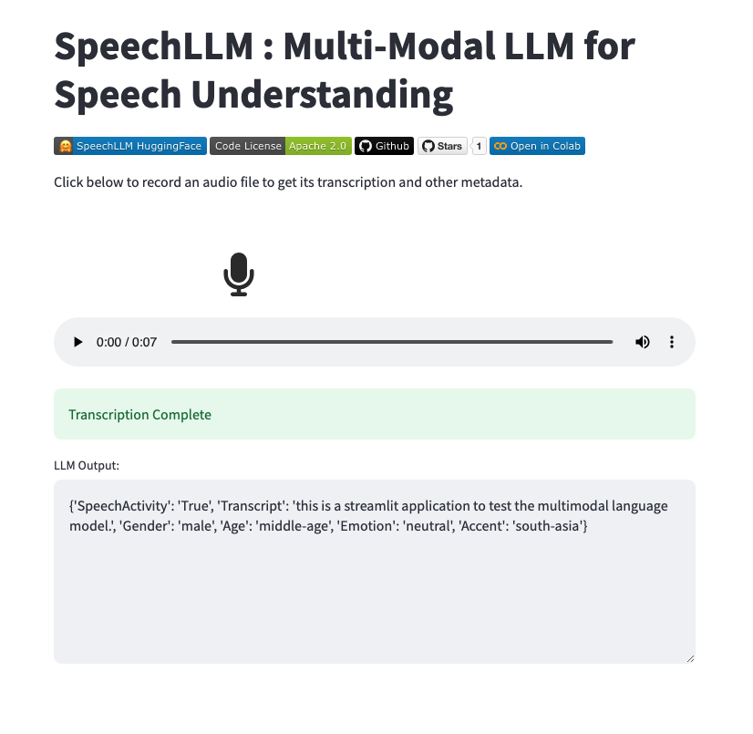

# SpeechLLM

[](https://huggingface.co/collections/skit-ai/speechllm-66605bfb37a54d4e4a60efe2)
[](https://github.com/skit-ai/SpeechLLM/blob/main/LICENSE)
[](https://github.com/skit-ai/SpeechLLM.git)[](https://github.com/skit-ai/SpeechLLM/stargazers)
[](https://colab.research.google.com/drive/1uqhRl36LJKA4IxnrhplLMv0wQ_f3OuBM?usp=sharing)


SpeechLLM is a multi-modal LLM trained to predict the metadata of the speaker's turn in a conversation. speechllm-2B model is based on HubertX audio encoder and TinyLlama LLM. The model predicts the following:
1. **SpeechActivity** : if the audio signal contains speech (True/False)
2. **Transcript** : ASR transcript of the audio
3. **Gender** of the speaker (Female/Male)
4. **Age** of the speaker (Young/Middle-Age/Senior)
5. **Accent** of the speaker (Africa/America/Celtic/Europe/Oceania/South-Asia/South-East-Asia)
6. **Emotion** of the speaker (Happy/Sad/Anger/Neutral/Frustrated)

## Usage
```python
# Load model directly from huggingface
from transformers import AutoModel
model = AutoModel.from_pretrained("skit-ai/speechllm-2B", trust_remote_code=True)

model.generate_meta(
    audio_path="path-to-audio.wav", #16k Hz, mono
    audio_tensor=torchaudio.load("path-to-audio.wav")[1], # [Optional] either audio_path or audio_tensor directly
    instruction="Give me the following information about the audio [SpeechActivity, Transcript, Gender, Emotion, Age, Accent]",
    max_new_tokens=500, 
    return_special_tokens=False
)

# Model Generation
'''
{
  "SpeechActivity" : "True",
  "Transcript": "Yes, I got it. I'll make the payment now.",
  "Gender": "Female",
  "Emotion": "Neutral",
  "Age": "Young",
  "Accent" : "America",
}
'''
```

Try the model in [Google Colab Notebook](https://colab.research.google.com/drive/1uqhRl36LJKA4IxnrhplLMv0wQ_f3OuBM?usp=sharing). Also, check out our [blog](https://tech.skit.ai/speech-conversational-llms/) on SpeechLLM for end-to-end conversational agents(User Speech -> Response).

## Model Weights
We released the speechllm-2B and speechllm-1.5B model checkpoints on huggingface :hugs:.
| **Model**         | **Speech Encoder**                                                                  | **LLM**                                                                                            | checkpoint url                                                |
|-------------------|-------------------------------------------------------------------------------------|----------------------------------------------------------------------------------------------------|---------------------------------------------------------------|
| **speechllm-2B**  | [facebook/hubert-xlarge-ll60k](https://huggingface.co/facebook/hubert-xlarge-ll60k) | [TinyLlama/TinyLlama-1.1B-Chat-v1.0](https://huggingface.co/TinyLlama/TinyLlama-1.1B-Chat-v1.0)    | [Huggingface](https://huggingface.co/skit-ai/speechllm-2B)    |
| **speechllm-1.5B** | [microsoft/wavlm-large](https://huggingface.co/microsoft/wavlm-large)               | [ TinyLlama/TinyLlama-1.1B-Chat-v1.0 ]( https://huggingface.co/TinyLlama/TinyLlama-1.1B-Chat-v1.0) | [Huggingface]( https://huggingface.co/skit-ai/speechllm-1.5B) |

## Latest Checkpoint Result

### speechllm-2B
|         **Dataset**        |       **Type**      | **Word Error Rate** | **Gender Acc** | **Age Acc** | **Accent Acc** |
|:--------------------------:|:-------------------:|:-------------------:|:--------------:|:-----------:|:--------------:|
| **librispeech-test-clean** | Read Speech         |         6.73        |     0.9496     |             |                |
| **librispeech-test-other** | Read Speech         |         9.13        |     0.9217     |             |                |
| **CommonVoice test**       | Diverse Accent, Age |        25.66        |     0.8680     |    0.6041   |     0.6959     |

### speechllm-1.5B
|         **Dataset**        |       **Type**      | **Word Error Rate** | **Gender Acc** | **Age Acc** | **Accent Acc** |
|:--------------------------:|:-------------------:|:-------------------:|:--------------:|:-----------:|:--------------:|
| **librispeech-test-clean** | Read Speech         |        11.51        |     0.9594     |             |                |
| **librispeech-test-other** | Read Speech         |        16.68        |     0.9297     |             |                |
| **CommonVoice test**       | Diverse Accent, Age |        26.02        |     0.9476     |    0.6498   |     0.8121     |


## Training

### Dataset Preparation and Installation
Install the necessary packages in the requirements.txt and take care of CUDA versions. Then prepare the audio dataset similar to data_samples/train.csv and data_samples/dev.csv, if new tasks eg: (noise, environment class) has to be added, then update the dataset.py accordingly.
```bash
pip install requirements.txt
``` 

### Train
update the config in train.py, such as audio_encoder_name, llm_name, etc and other hyper parameters.
```bash
python train.py
``` 

### Evaluation
After training, update checkpoint path and test dataset path(similar format to train/dev.csv).
```bash
python test.py
``` 

### Infer model in Streamlit app
```bash
streamlit run app.py
```



## Disclaimer
The models provided in this repository are not perfect and may produce errors in Automatic Speech Recognition (ASR), gender identification, age estimation, accent recognition, and emotion detection. Additionally, these models may exhibit biases related to gender, age, accent, and emotion. Please use with caution, especially in production environments, and be aware of potential inaccuracies and biases.

## License
This project is released under the Apache 2.0 license as found in the LICENSE file. The released checkpoints, and code are intended for research purpose subject to the license of [facebook/hubert-xlarge-ll60k](https://huggingface.co/facebook/hubert-xlarge-ll60k), [microsoft/wavlm-large](https://huggingface.co/microsoft/wavlm-large) and [ TinyLlama/TinyLlama-1.1B-Chat-v1.0 ]( https://huggingface.co/TinyLlama/TinyLlama-1.1B-Chat-v1.0) models.
